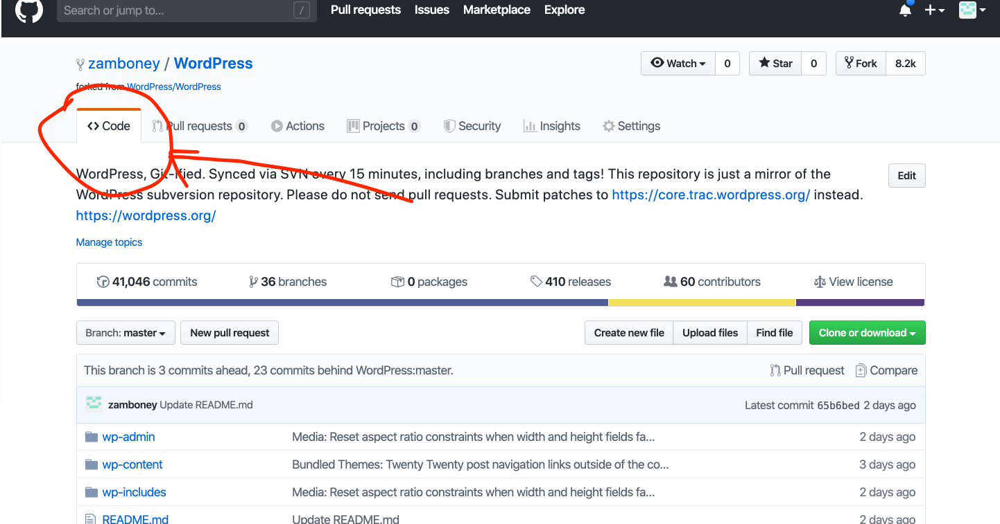
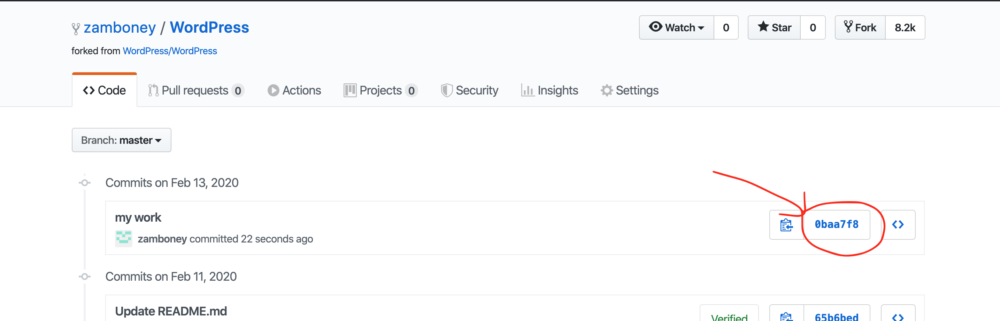

# Premier job interview project

## installation

* download [Docker](https://www.docker.com/get-started).
* install [docker-compose](https://docs.docker.com/compose/install/).
* install [git](https://git-scm.com/downloads).
* login to [GitHub](https://github.com).
* fork the [WordPress repo](https://github.com/zamboney/WordPress).

* copy the repo url.

* clone the repo to your machine `git clone <copy-ur>`
* open the repo in the terminal `~/WordPress`.
* run in the run in the terminal `docker-compose up -d`


## create a WordPress content form

### Back-End

* write each content request to the WordPress MySQL database.
  * create a unique content request table that saves the name, email and phone number
* a notification should be sent to the admin email.

### Front-End

* there should be three field
  * Name
  * Email
  * Phone number
* when one of the fields isn't filled, there should be an error message under the unfilled area.

## Submit the code

* commit your code in one commit and push the changes to **your** repo

```bash
git commit -am "my work" && git push
```

* open **your** fork repo and go to the code section



* make sure that your commit is there



* copy the url and send it back to us.

# GOOD LUCK!
